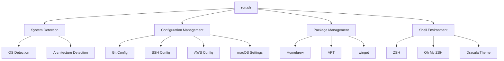
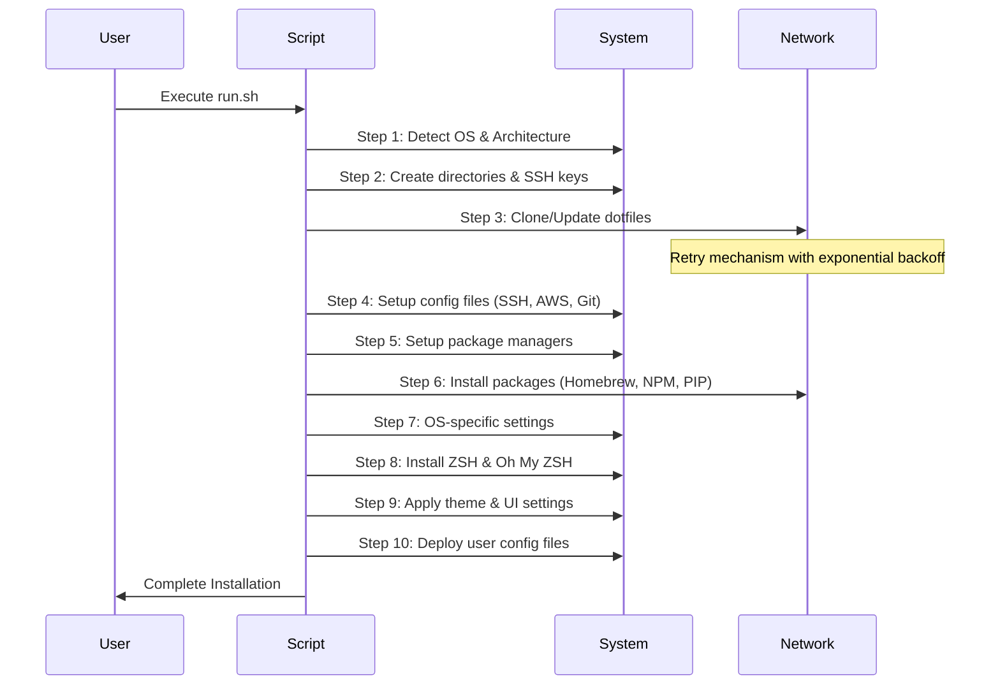

# Architecture

## Overview

This project is a development environment automation tool that provides consistent setup across different operating systems. It follows a modular architecture with clear separation of concerns.

## Core Components



## Directory Structure

```
.
├── CLAUDE.md              # Project-specific Claude Code instructions
├── README.md              # Project overview and installation guide
├── run.sh                 # Main installation script (10-step process)
├── run.ps1                # Windows PowerShell installation script
│
├── aliases                # Custom command aliases and helper functions
├── bashrc                 # Bash shell configuration
├── gitconfig              # Git default settings
├── gitconfig-bruce        # Bruce organization Git profile
├── gitconfig-nalbam       # nalbam organization Git profile
├── macos                  # macOS system preferences script
├── profile                # Shell environment variables
├── vimrc                  # Vim editor settings
├── wgetrc                 # wget configuration
├── zshrc                  # ZSH shell configuration
│
├── aws/                   # AWS configuration templates
│   └── config             # AWS CLI config template
├── darwin/                # macOS specific configurations
│   ├── Brewfile           # macOS Homebrew package list
│   ├── zprofile.arm64.sh  # Apple Silicon profile
│   └── zprofile.x86_64.sh # Intel Mac profile
├── docs/                  # Technical documentation
│   ├── ARCHITECTURE.md    # System architecture
│   └── README.md          # Documentation index
├── iterm2/                # iTerm2 configuration
│   └── profiles.json      # Dracula theme profile
├── linux/                 # Linux specific configurations
│   ├── Brewfile           # Linux Homebrew package list
│   ├── zprofile.aarch64.sh  # Raspberry Pi 64-bit profile
│   ├── zprofile.armv7l.sh   # Raspberry Pi 32-bit profile
│   └── zprofile.x86_64.sh   # WSL/Ubuntu profile
├── mac/                   # macOS keyboard settings
│   └── DefaultkeyBinding.dict  # Korean won symbol mapping
└── ssh/                   # SSH configuration templates
    └── config             # SSH config template
```

## Core Functions

1. System Detection
   - OS detection (darwin/linux/windows)
   - Architecture detection (x86_64/arm64/aarch64/armv7l)
   - Package manager selection (brew/apt/winget)

2. Configuration Management
   - Git configuration with organization-specific settings
   - SSH key generation and configuration
   - AWS CLI configuration
   - macOS system preferences

3. Package Management
   - Homebrew for macOS and Linux
   - APT for Linux
   - winget for Windows
   - NPM for Node.js packages (npm, corepack, serverless, ccusage)
   - PIP for Python packages (toast-cli) with intelligent fallback (normal → --user → --break-system-packages → sudo)
   - Update throttling with timestamp tracking (12-hour interval minimum between updates)

4. Shell Environment
   - ZSH as default shell
   - Oh My ZSH installation with plugins (git, kube-ps1)
   - Dracula theme integration (ZSH and iTerm2)
   - Custom aliases and profiles
   - Tool version managers (tfenv, pyenv, nvm)
   - VS Code and Kiro terminal shell integration
   - Toast CLI workspace management integration

5. Claude Code Integration
   - Claude Code settings managed in separate repository: [vibe-config](https://github.com/nalbam/vibe-config)
   - Use `sync.sh` script to sync settings to `~/.claude/`

## Installation Flow



## Security Considerations

1. File Permissions
   - SSH config: 600
   - AWS config: 600
   - Backup files: 600
   - Automatic permission setting for sensitive files
   - Secure backup handling

2. Authentication
   - SSH key generation
   - Git credentials management
   - Organization-specific email configuration
   - Safe credential handling

## Advanced Features

1. Toast CLI Integration
   - Workspace and environment management
   - Context switching (AWS, Kubernetes, etc.)
   - Extensive alias shortcuts for common operations
   - Directory navigation with `c()` function

2. Development Helpers
   - **Node.js**: Smart package manager detection (pnpm/npm), automatic cleanup, dev server port management
   - **Local Servers**: Python HTTP server management (start, list, kill) with port conflict resolution
   - **Terraform**: Complete alias set with state management, automatic formatting
   - **AWS Vault**: Profile shortcuts with automatic credential handling

3. Shell Customization
   - **tfenv**: Automatic Terraform version installation with ARM64 support
   - **Korean keyboard**: Native Korean character aliases for common commands
   - **Terminal integration**: VS Code and Kiro terminal shell integration
   - **Environment variables**: Support for `.claude/.env.local` configuration

## Performance Optimization

1. Package Management
   - Update throttling with 12-hour minimum interval
   - Timestamp tracking for APT and Homebrew
   - Version-aware package installation (skip if already latest)
   - Optimized download retry with exponential backoff
   - Connection timeout handling

2. Installation Process
   - Progress tracking with step counting
   - Modular installation steps
   - Conditional execution
   - Efficient error recovery

## Error Handling

1. System Compatibility
   - OS version verification
   - Architecture compatibility check
   - Package manager availability
   - Directory access verification

2. Network Issues
   - Exponential backoff retry mechanism
   - Connection timeout handling
   - Maximum retry attempts (3회)
   - Detailed error reporting
   - Graceful fallback handling

3. File Operations
   - Backup creation verification
   - Permission setting validation (600 for sensitive files)
   - File integrity checks using MD5
   - Safe directory navigation with error handling

## Future Considerations

1. Extensibility
   - Plugin system for custom configurations
   - Organization-specific extensions
   - Custom theme support
   - Enhanced error handling patterns

2. Maintenance
   - Version control
   - Dependency updates
   - Configuration backups
   - Automated testing integration
