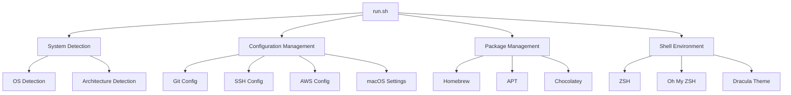
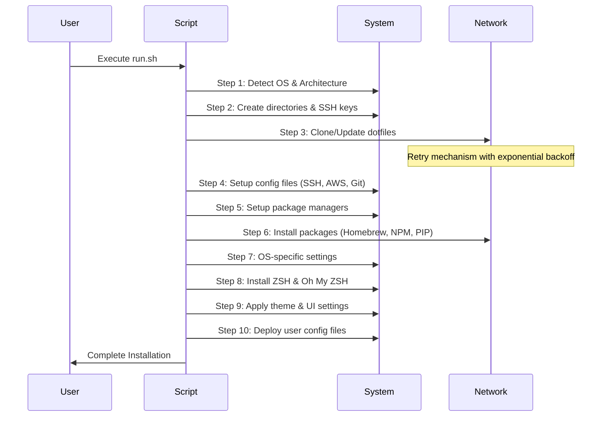

# Architecture

## Overview

This project is a development environment automation tool that provides consistent setup across different operating systems. It follows a modular architecture with clear separation of concerns.

## Core Components



## Directory Structure

```
.
├── run.sh              # Main installation script (10-step process)
├── run.ps1             # Windows PowerShell installation script
├── darwin/             # macOS specific configurations
│   ├── Brewfile        # macOS Homebrew package list
│   └── .zprofile.*     # Architecture-specific profile settings
├── linux/              # Linux specific configurations
│   ├── Brewfile        # Linux Homebrew package list
│   └── .zprofile.*     # Profile settings
└── claude/             # Claude Code AI settings
    ├── CLAUDE.md       # Claude Code instructions (EN)
    ├── CLAUDE.ko.md    # Claude Code instructions (KO)
    └── settings.json   # Claude Code configuration
```

## Core Functions

1. System Detection
   - OS detection (darwin/linux/windows)
   - Architecture detection (x86_64/arm64)
   - Package manager selection (brew/apt/choco)

2. Configuration Management
   - Git configuration with organization-specific settings
   - SSH key generation and configuration
   - AWS CLI configuration
   - macOS system preferences

3. Package Management
   - Homebrew for macOS and Linux
   - APT for Linux
   - Chocolatey for Windows
   - NPM for Node.js packages (claude-code, ccusage, serverless)
   - PIP for Python packages (toast-cli)
   - Daily update optimization with timestamp tracking (12-hour interval)

4. Shell Environment
   - ZSH as default shell
   - Oh My ZSH installation
   - Dracula theme integration
   - Custom aliases and profiles

## Installation Flow



## Security Considerations

1. File Permissions
   - SSH config: 600
   - AWS config: 600
   - Backup files: 600
   - Automatic permission setting for sensitive files
   - Secure backup handling

2. Authentication
   - SSH key generation
   - Git credentials management
   - Organization-specific email configuration
   - Safe credential handling

## Performance Optimization

1. Package Management
   - Daily update limitation with timestamp tracking
   - Intelligent update scheduling
   - Optimized download retry mechanism
   - Connection timeout handling

2. Installation Process
   - Progress tracking with step counting
   - Modular installation steps
   - Conditional execution
   - Efficient error recovery

## Error Handling

1. System Compatibility
   - OS version verification
   - Architecture compatibility check
   - Package manager availability
   - Directory access verification

2. Network Issues
   - Exponential backoff retry mechanism
   - Connection timeout handling
   - Maximum retry attempts (3회)
   - Detailed error reporting
   - Graceful fallback handling

3. File Operations
   - Backup creation verification
   - Permission setting validation (600 for sensitive files)
   - File integrity checks using MD5
   - Safe directory navigation with error handling

## Future Considerations

1. Extensibility
   - Plugin system for custom configurations
   - Organization-specific extensions
   - Custom theme support
   - Enhanced error handling patterns

2. Maintenance
   - Version control
   - Dependency updates
   - Configuration backups
   - Automated testing integration
