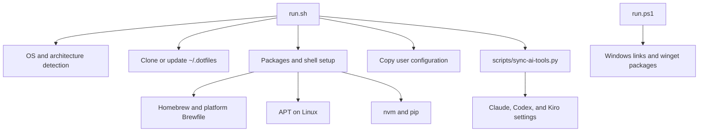

# Architecture

Use this guide when changing the installer or diagnosing a partial installation. For commands to install or deploy settings, start with the [main README](../README.md).

## Entry points

| Entry point | Purpose | Preconditions |
|-------------|---------|---------------|
| `run.sh` | Full development setup for macOS and APT-based Linux | Run as the target user; Bash, curl, network access, and access to sudo when requested |
| `run.sh --vibe` | Deploy AI settings only | A populated `~/.dotfiles` checkout and Python 3.11+ |
| `run.ps1` | Windows Git/Vim links, Git and 7-Zip packages, optional `custom.ps1` | Checkout at `$HOME\.dotfiles`, winget, and permission to create symlinks |
| `linux/init.sh` | Prepare a fresh Ubuntu server | Root access; see the [Linux guide](../linux/README.md) |
| `nvim/install.sh` | Copy the Neovim configuration | See the [Neovim guide](../nvim/README.md) |

`run.ps1`, `linux/init.sh`, and `nvim/install.sh` are separate entry points. The full Bash installer does not invoke them. AI settings deployment does not install all AI CLIs.

## Core Components


```mermaid
flowchart TD
    A[run.sh] --> B[OS and architecture detection]
    A --> C[Clone or update ~/.dotfiles]
    A --> D[Packages and shell setup]
    A --> E[Copy user configuration]
    A --> F[scripts/sync-ai-tools.py]
    D --> G[Homebrew and platform Brewfile]
    D --> H[APT on Linux]
    D --> I[nvm and pip]
    F --> J[Claude, Codex, and Kiro settings]
    K[run.ps1] --> L[Windows links and winget packages]
```

The full installer reads its shell block before execution so a repository update cannot replace the script while the shell is still reading it. `_dotfiles` uses `git -C` to preserve the caller's working directory.

Both full installation and `--vibe` read deployment sources from `~/.dotfiles`. Running a script in another checkout does not change that source path. `--vibe` skips repository updates and all package and shell setup.

## Directory Structure

| Source | Owner or consumer |
|--------|-------------------|
| `run.sh`, `run.ps1` | Installation order and platform-specific entry points |
| `darwin/Brewfile`, `linux/Brewfile` | Package selection; commented entries are inactive |
| `aliases` | Shared shell aliases and helper functions |
| `zshrc`, `bashrc`, `profile`, platform `zprofile.*.sh` | Shell initialization |
| `gitconfig*` | Base Git settings and directory-specific identities |
| `ssh/`, `aws/` | Templates; only the files selected by `run.sh` are deployed |
| `macos` | macOS preferences applied in Step 7 |
| `iterm2/`, `ghostty/`, `tmux.conf`, `vimrc` | Terminal and editor settings copied by the installer |
| `nvim/` | Separately installed Neovim configuration |
| `claude/`, `codex/`, `kiro/` | AI settings sources |
| `scripts/` | Skill generation, AI settings deployment, and isolated tests |
| `AGENTS.md`, `CLAUDE.md` | Repository instructions; `CLAUDE.md` links to `AGENTS.md` |

Read the source file for exact packages and configuration values. The [AI settings table](../README.md#원본과-배포-대상) maps repository files to deployed paths.

## Installation Flow

| Step | Action | Condition or result |
|------|--------|---------------------|
| 1 | Detect OS and architecture | Reject an unrecognized OS |
| 2 | Create working directories and missing SSH keys | Set `~/.ssh` to mode `700` |
| 3 | Clone or update `~/.dotfiles` | Skip if Git or macOS Command Line Tools are unavailable; retry after Step 5 if the checkout is still missing |
| 4 | Copy SSH, AWS, and Git configuration | Preserve existing SSH/AWS config; compare and back up changed Git files |
| 5 | Prepare package managers | Use APT on Linux and attempt Homebrew installation |
| 6 | Install or update development tools | Apply the Brewfile, bootstrap Node.js 24 through nvm, update installed Claude Code, and install `toast-cli` through pip |
| 7 | Apply OS settings | On macOS, check Command Line Tools and Rosetta, then apply key bindings and preferences |
| 8 | Set up Zsh and Oh My Zsh | Change the default shell if needed |
| 9 | Set up themes and terminal profiles | Apply Dracula resources; copy iTerm2/Ghostty settings on macOS |
| 10 | Copy user configuration | Shell files, aliases, Vim, tmux, and the matching platform profile |
| 11 | Deploy AI settings | Run `scripts/sync-ai-tools.py`; a failure stops installation |

Step 6 does not install global npm packages. Node.js is managed through nvm; package selection otherwise comes from the Brewfile and pip setup.

## Updates and retries

- `_retry` makes at most three attempts and waits 5 seconds, then 10 seconds. It wraps selected downloads and Git operations, not every network call.
- Update markers are stored at `~/.toast/last_update_*` with a six-hour interval.
- APT, Homebrew, Claude, and pip update markers advance only after their checked operations succeed. Failed updates remain eligible on the next run.
- A changed Brewfile bypasses the update interval. `~/.Brewfile` stores the last successfully bundled content, so a failed bundle remains eligible for another attempt.
- The pip package helper tries normal installation, `--user`, `--break-system-packages --user`, then sudo. The separate pip-tool upgrade has no sudo fallback.

## Configuration and backups

### User files

When a source exists in `~/.dotfiles`, `_download` compares it with the destination using MD5. If the source is missing, it downloads the file from the repository's `main` branch. Changed content is staged in the destination directory before the existing file is backed up and atomically replaced. A failed copy or download leaves the destination unchanged. Identical content leaves both the destination and its backup unchanged. MD5 detects content changes; it does not authenticate a download.

Copied SSH/AWS files and backups receive mode `600`. These backups hold the previous version of each file, not a complete system snapshot. The full installer has no global rollback.

### macOS preferences

`macos` closes System Settings but keeps the terminal running. Preferences that require a new session take effect after logout or restart.

`~/.toast/macos.applied` records the source content only after all preference commands succeed. `~/.macos.backup` is a file backup and does not indicate successful application. If settings change or application fails, the next run tries again.

The startup-sound setting requests sudo only when it needs to change. Screen-lock configuration uses `sysadminctl`, reads the login password from the terminal, and verifies that the effective delay is immediate. Without a terminal or a successful verification, the preference step warns and leaves the completion marker unchanged.

### AI settings

The Python sync process acquires a lock, validates source paths and all merge results, then applies changes. It backs up changed or removed managed files and replaces each written file atomically. It updates target manifests after all file operations succeed.

Codex approval and sandbox selection follow the repository when its config declares `default_permissions`. Other existing JSON/TOML values and local Codex rules outside the managed block are preserved. A manifest lists previously deployed files; pruning affects only those files. Unmanaged files remain in place. Missing or empty source directories preserve the corresponding deployed files and manifest.

A write failure can leave earlier files updated. There is no transaction across all files and manifests. Fix the reported cause and rerun the sync. See [preservation and failure handling](../README.md#기존-설정-보존과-실패-처리).

## AI instructions and skills

Global instructions live in `claude/CLAUDE.md` and `codex/AGENTS.md`. They apply ISO 24495-1 principles for reader needs, navigation, understanding, and use, together with ASD-STE100 principles for short, clear, unambiguous wording. Project-specific commands belong in repository instructions.

`claude/skills/` is the source for shared skills. `scripts/gen-codex-skills.py` adapts tool-specific instructions and mirrors Markdown to `codex/skills/`. It preserves manually maintained Codex metadata. Its `--check` mode reports mismatches and stale generated files.

Claude's memory hook uses a separate private Git repository. An OS file lock serializes clone, project-memory migration, and Git synchronization. Session hooks launch this work in the background. A failed Git stage stops the following stages. This hook does not sync Codex transcripts or authorize commits in the current project.

## Failure diagnosis

| Symptom | Check and next action |
|---------|-----------------------|
| Full install reports warnings | Read the corresponding warning lines, fix the cause, and rerun; exit status alone does not prove every package was installed |
| Repository update fails | Inspect `~/.dotfiles` Git state and network access; the installer can continue with that checkout |
| Command Line Tools dialog opens | Complete installation, then rerun |
| macOS settings are retried | Check authentication and the preference error; a file backup is not an application marker |
| AI sync fails | Check the reported file, lock, Python version, or merge error; rerun after resolving it |
| New instructions do not appear | Compare deployed files with the intended checkout and confirm the tool's instruction path and session |

## Verification

Run the complete regression suite and generated-skill check from the repository root:

```bash
python3 scripts/gen-codex-skills.py --check
python3 -m unittest discover -s scripts -p 'test_*.py'
bash -n run.sh
bash -n claude/hooks/memory-sync.sh
git diff --check
```

For a focused macOS check, use:

```bash
python3 scripts/test_macos.py
bash -n macos
```

Tests use temporary homes and mocked system or Git commands. Server tests also start a temporary local HTTP server. PowerShell tests are skipped when its runtime is absent. Tests do not validate real package installation, live OS preferences, or external accounts. Deployment comparisons are documented in [AI Tools Sync](../README.md#배포와-결과-확인).
